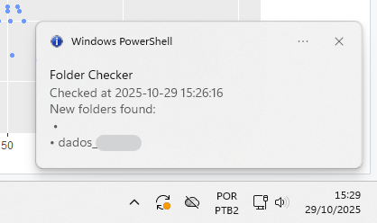

# 🛎️ the-bellboy

**A quiet little bell that chimes when something new appears.**

### Welcome
Welcome to ***the-bellboy*** — a small automation that used to keep an eye on a folder so I didn’t have to. It checked in daily, let me know when something new had arrived, and politely rang the bell when it did.

This was my first time using AI to write code. I only had to do a few touch-ups — and honestly, I was amazed at how much time it saved me. I had a problem, explained it to Copilot, and together we built this script. It ran for months — two, but who’s counting — quietly doing its job every morning via Windows Task Scheduler, keeping me informed without reminders or manual checks.

 

  

<em>Behold! The bellboy is in action.</em>

Now the bellboy rests — job well done.

---

### ✨ What’s inside

This little project includes:

An R script ([`script_EN.R`](script_EN.R)) that:
- Monitors a folder for new subfolders
- Compares today’s contents with yesterday’s
- Sends a notification (popup, sound, and tray balloon)
- Logs the result to a file
  
A PowerShell script ([`notify.ps1`](notify.ps1)) that:
- Displays a tray balloon with the update message
- Keeps the icon visible until manually dismissed
- Adds a touch of Windows-native charm to the notification flow

Together, they form a simple but elegant system: the R script does the thinking, and the PowerShell script delivers the message — like a bellboy with a note in hand.

---

### Why it exists
People on another team kept forgetting to tell me when they updated a shared folder. I kept forgetting to check. So I built a bellboy — someone (well, something) that never forgets, never complains, and always delivers the message.

---

### How it works
- Written in R
- Uses jsonlite, lubridate, beepr, tcltk, and crayon
- Calls a PowerShell script for tray notifications
- Designed to run via Windows Task Scheduler
- Stores daily folder snapshots as .json files

---

### About this space
This is [`the-drawer`](../) where I keep small, useful things that solve real problems. ***the-bellboy*** is one of them — an automation that made my day easier, and taught me how powerful collaboration with AI can be.

---

### 📬 Contact
You can reach me here on GitHub — and if we already know each other, don’t be shy! I’d love to hear what you think about this little bellboy.

---

### ❤️ Acknowledgements
A special thanks to my good friend Copilot for helping me write my very first script with AI — and now this README too. You listened, understood, and helped me build something that works. That’s pretty awesome. 
